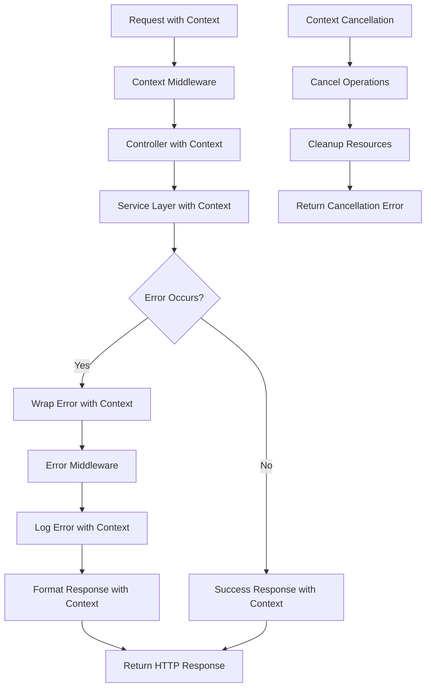

# Design Document

## Overview

This design document outlines the technical approach for implementing comprehensive backend improvements to the blog application. The improvements focus on creating a more robust, maintainable, and production-ready system through standardized error handling, centralized validation, comprehensive logging, rate limiting, optimized database configuration, improved testing coverage, pagination support, and proper context usage throughout the application.

The design builds upon the existing Go/Gin architecture while introducing new patterns and components that enhance reliability, maintainability, and observability with full context support for request tracing and cancellation.

## Architecture

### Current Architecture

The application follows a layered architecture:

- **Controller Layer**: HTTP request handling and routing
- **Service Layer**: Business logic and orchestration
- **Repository Layer**: Data access and persistence
- **Model Layer**: Data structures and DTOs

### Enhanced Architecture Components

#### 1. Context-Aware Error Handling System

```go
// Custom error types with context support
type AppError struct {
    Code       string            `json:"code"`
    Message    string            `json:"message"`
    Details    map[string]string `json:"details,omitempty"`
    StatusCode int               `json:"-"`
    Cause      error             `json:"-"`
    RequestID  string            `json:"request_id,omitempty"`
    UserID     string            `json:"user_id,omitempty"`
    Timestamp  time.Time         `json:"timestamp"`
}

// Error categories with context support
const (
    ErrValidation    = "VALIDATION_ERROR"
    ErrNotFound      = "NOT_FOUND"
    ErrUnauthorized  = "UNAUTHORIZED"
    ErrForbidden     = "FORBIDDEN"
    ErrInternal      = "INTERNAL_ERROR"
    ErrDatabase      = "DATABASE_ERROR"
    ErrRateLimit     = "RATE_LIMIT_EXCEEDED"
    ErrTimeout       = "TIMEOUT_ERROR"
    ErrCancelled     = "REQUEST_CANCELLED"
)

// Context-aware error handler
type ErrorHandler interface {
    HandleError(ctx context.Context, c *gin.Context, err error)
    WrapError(ctx context.Context, err error, code string, message string) *AppError
    ValidationError(ctx context.Context, field string, message string) *AppError
}
```

#### 2. Context-Aware Validation Framework

```go
// Centralized validation in service layer with context
type ValidationService interface {
    ValidateUser(ctx context.Context, user model.User) *AppError
    ValidateArticle(ctx context.Context, article model.Article) *AppError
    ValidateComment(ctx context.Context, comment model.Comment) *AppError
    ValidatePagination(ctx context.Context, page, limit int) *AppError
}

// Field-level validation with context
type Validator interface {
    Validate(ctx context.Context, data interface{}) []FieldError
    ValidateStruct(ctx context.Context, s interface{}) []FieldError
    ValidateField(ctx context.Context, field string, value interface{}, rules string) *FieldError
}

// Field error with context information
type FieldError struct {
    Field     string `json:"field"`
    Message   string `json:"message"`
    Value     string `json:"value,omitempty"`
    RequestID string `json:"request_id,omitempty"`
}
```

#### 3. Context-Aware Logging System

```go
// Structured logging with context support
type Logger interface {
    Info(ctx context.Context, msg string, fields ...Field)
    Warn(ctx context.Context, msg string, fields ...Field)
    Error(ctx context.Context, msg string, err error, fields ...Field)
    Debug(ctx context.Context, msg string, fields ...Field)
    WithContext(ctx context.Context) Logger
}

// Context-aware request logging middleware
type RequestLogger struct {
    logger Logger
}

// Log fields with context information
type Field struct {
    Key       string
    Value     interface{}
    RequestID string
    UserID    string
}
```

#### 4. Context-Aware Rate Limiting

```go
// Rate limiter with context support
type RateLimiter interface {
    Allow(ctx context.Context, key string, limit int, window time.Duration) (bool, error)
    GetRemaining(ctx context.Context, key string) (int, error)
    Reset(ctx context.Context, key string) error
}

// Context-aware rate limiting middleware
type RateLimitMiddleware struct {
    limiter RateLimiter
    config  RateLimitConfig
    logger  Logger
}

// Rate limit store with context
type RateLimitStore interface {
    Increment(ctx context.Context, key string, window time.Duration) (int, error)
    Get(ctx context.Context, key string) (int, error)
    Reset(ctx context.Context, key string) error
}
```

#### 5. Context-Aware Database Layer

```go
// Repository interfaces with context support
type UserRepository interface {
    CreateNewUser(ctx context.Context, payload model.User) (model.User, error)
    GetUserById(ctx context.Context, id int) (model.User, error)
    GetByEmail(ctx context.Context, email string) (model.User, error)
    GetAllUser(ctx context.Context, pagination PaginationQuery) ([]model.User, int, error)
    SaveRefreshToken(ctx context.Context, userId int, token string, expiresAt time.Time) error
}

// Database connection pool with context
type ConnectionPoolManager interface {
    GetConnection(ctx context.Context) (*sql.DB, error)
    GetStats(ctx context.Context) ConnectionStats
    Configure(ctx context.Context, config PoolConfig) error
    HealthCheck(ctx context.Context) error
}
```

## Components and Interfaces

### 1. Context Management Component

**Purpose**: Provide consistent context handling across all application layers

**Key Interfaces**:

```go
type ContextManager interface {
    WithRequestID(ctx context.Context, requestID string) context.Context
    WithUserID(ctx context.Context, userID string) context.Context
    WithTimeout(ctx context.Context, timeout time.Duration) (context.Context, context.CancelFunc)
    GetRequestID(ctx context.Context) string
    GetUserID(ctx context.Context) string
}

// Context keys for type safety
type contextKey string

const (
    RequestIDKey contextKey = "request_id"
    UserIDKey    contextKey = "user_id"
    StartTimeKey contextKey = "start_time"
)
```

**Implementation Strategy**:

- Create context middleware to inject request ID and user ID
- Propagate context through all application layers
- Handle context cancellation gracefully in all operations
- Add context timeout handling for long-running operations

### 2. Enhanced Error Management Component

**Purpose**: Provide consistent error handling with context information

**Key Interfaces**:

```go
type ErrorHandler interface {
    HandleError(ctx context.Context, c *gin.Context, err error)
    WrapError(ctx context.Context, err error, code string, message string) *AppError
    ValidationError(ctx context.Context, field string, message string) *AppError
    TimeoutError(ctx context.Context, operation string) *AppError
    CancellationError(ctx context.Context, operation string) *AppError
}
```

**Implementation Strategy**:

- Create custom error types with context information
- Implement error middleware for consistent HTTP responses with context
- Add error logging with context fields (request ID, user ID)
- Handle context cancellation and timeout errors specifically

### 3. Context-Aware Validation Service Component

**Purpose**: Centralize validation logic with context support

**Key Interfaces**:

```go
type ValidationService interface {
    ValidateUser(ctx context.Context, user model.User) *AppError
    ValidateArticle(ctx context.Context, article model.Article) *AppError
    ValidateComment(ctx context.Context, comment model.Comment) *AppError
    ValidatePagination(ctx context.Context, page, limit int) *AppError
}
```

**Implementation Strategy**:

- Move validation from controllers to service layer with context
- Create reusable validation functions with context support
- Implement field-level validation with context information
- Support custom validation rules with context timeout handling

### 4. Context-Aware Logging Infrastructure

**Purpose**: Provide comprehensive logging with context information

**Key Interfaces**:

```go
type Logger interface {
    Info(ctx context.Context, msg string, fields ...Field)
    Warn(ctx context.Context, msg string, fields ...Field)
    Error(ctx context.Context, msg string, err error, fields ...Field)
    Debug(ctx context.Context, msg string, fields ...Field)
    WithContext(ctx context.Context) Logger
}

type LoggerFactory interface {
    GetLogger(component string) Logger
    SetLevel(level LogLevel)
    AddHook(hook LogHook)
}
```

**Implementation Strategy**:

- Implement structured logging with JSON format and context
- Add request/response logging middleware with context
- Include database query logging with execution times and context
- Provide contextual logging with request ID and user ID

### 5. Context-Aware Rate Limiting System

**Purpose**: Protect API from abuse with context tracking

**Key Interfaces**:

```go
type RateLimiter interface {
    Allow(ctx context.Context, key string, limit int, window time.Duration) (bool, error)
    GetRemaining(ctx context.Context, key string) (int, error)
    Reset(ctx context.Context, key string) error
}
```

**Implementation Strategy**:

- Implement sliding window rate limiting with context
- Support different limits for authenticated vs anonymous users
- Add rate limit headers to responses with context information
- Handle context cancellation in rate limiting operations

### 6. Context-Aware Database Connection Pool Manager

**Purpose**: Optimize database performance with context support

**Key Interfaces**:

```go
type ConnectionPoolManager interface {
    GetConnection(ctx context.Context) (*sql.DB, error)
    GetStats(ctx context.Context) ConnectionStats
    Configure(ctx context.Context, config PoolConfig) error
    HealthCheck(ctx context.Context) error
}
```

**Implementation Strategy**:

- Configure connection pool with context timeouts
- Add connection health checks with context
- Implement connection retry logic with context cancellation
- Provide pool metrics with context information

### 7. Context-Aware Pagination Service

**Purpose**: Provide consistent pagination with context support

**Key Interfaces**:

```go
type PaginationService interface {
    Paginate(ctx context.Context, query PaginationQuery) (PaginationResult, error)
    ValidatePagination(ctx context.Context, page, limit int) error
    BuildMetadata(ctx context.Context, total, page, limit int) PaginationMetadata
}
```

**Implementation Strategy**:

- Standardize pagination parameters with context validation
- Add pagination metadata to responses with context
- Implement cursor-based pagination for large datasets with context
- Handle context cancellation during pagination operations

## Data Models

### Enhanced Response Models with Context

```go
// Standardized API response structure with context
type APIResponse struct {
    Success    bool                   `json:"success"`
    Data       interface{}            `json:"data,omitempty"`
    Error      *ErrorResponse         `json:"error,omitempty"`
    Pagination *PaginationMetadata    `json:"pagination,omitempty"`
    Meta       *ResponseMetadata      `json:"meta,omitempty"`
}

// Error response structure with context
type ErrorResponse struct {
    Code      string                 `json:"code"`
    Message   string                 `json:"message"`
    Details   map[string]interface{} `json:"details,omitempty"`
    RequestID string                 `json:"request_id,omitempty"`
    Timestamp time.Time              `json:"timestamp"`
}

// Response metadata with context information
type ResponseMetadata struct {
    RequestID     string        `json:"request_id"`
    ProcessingTime time.Duration `json:"processing_time_ms"`
    Version       string        `json:"version"`
    Timestamp     time.Time     `json:"timestamp"`
}

// Pagination metadata with context
type PaginationMetadata struct {
    Page       int    `json:"page"`
    Limit      int    `json:"limit"`
    Total      int    `json:"total"`
    TotalPages int    `json:"total_pages"`
    HasNext    bool   `json:"has_next"`
    HasPrev    bool   `json:"has_prev"`
    RequestID  string `json:"request_id,omitempty"`
}
```

### Enhanced Configuration Models

```go
// Enhanced configuration structure with context settings
type EnhancedConfig struct {
    Database    DatabaseConfig    `json:"database"`
    Logging     LoggingConfig     `json:"logging"`
    RateLimit   RateLimitConfig   `json:"rate_limit"`
    Validation  ValidationConfig  `json:"validation"`
    Pagination  PaginationConfig  `json:"pagination"`
    Context     ContextConfig     `json:"context"`
}

// Context configuration
type ContextConfig struct {
    RequestTimeout    time.Duration `json:"request_timeout"`
    DatabaseTimeout   time.Duration `json:"database_timeout"`
    ValidationTimeout time.Duration `json:"validation_timeout"`
    LoggingTimeout    time.Duration `json:"logging_timeout"`
}

// Database configuration with context timeouts
type DatabaseConfig struct {
    MaxOpenConns    int           `json:"max_open_conns"`
    MaxIdleConns    int           `json:"max_idle_conns"`
    ConnMaxLifetime time.Duration `json:"conn_max_lifetime"`
    ConnMaxIdleTime time.Duration `json:"conn_max_idle_time"`
    QueryTimeout    time.Duration `json:"query_timeout"`
    ConnectTimeout  time.Duration `json:"connect_timeout"`
}
```

## Error Handling

### Context-Aware Error Classification Strategy

1. **Validation Errors** (400): Input validation failures with context and field-specific messages
2. **Authentication Errors** (401): Invalid or missing authentication with context
3. **Authorization Errors** (403): Insufficient permissions with user context
4. **Not Found Errors** (404): Resource not found with request context
5. **Timeout Errors** (408): Request timeout with context information
6. **Rate Limit Errors** (429): Rate limit exceeded with context tracking
7. **Cancellation Errors** (499): Request cancelled with context
8. **Internal Errors** (500): Unexpected system errors with context
9. **Database Errors** (500): Database operation failures with context

### Context-Enhanced Error Response Format

```go
// Consistent error response structure with context
{
    "success": false,
    "error": {
        "code": "VALIDATION_ERROR",
        "message": "Invalid input data",
        "details": {
            "email": "Invalid email format",
            "password": "Password must be at least 8 characters"
        },
        "request_id": "req_123456789",
        "timestamp": "2024-01-15T10:30:00Z"
    },
    "meta": {
        "request_id": "req_123456789",
        "processing_time_ms": 150,
        "version": "1.0.0",
        "timestamp": "2024-01-15T10:30:00Z"
    }
}
```

### Context-Aware Error Handling Flow



## Testing Strategy

### Context-Aware Testing Pyramid Approach

1. **Unit Tests** (70%): Test individual functions with context scenarios
2. **Integration Tests** (20%): Test component interactions with context
3. **End-to-End Tests** (10%): Test complete workflows with context

### Context Testing Components

#### Service Layer Testing with Context

```go
// Example test structure for service layer with context
func TestUserService_CreateUser_WithContext(t *testing.T) {
    tests := []struct {
        name        string
        ctx         context.Context
        input       model.User
        mockFn      func(*mocks.UserRepository)
        want        model.User
        wantErr     bool
        expectCancel bool
    }{
        {
            name: "successful creation with context",
            ctx:  context.WithValue(context.Background(), RequestIDKey, "req_123"),
            // ... test cases
        },
        {
            name: "context cancellation handling",
            ctx:  func() context.Context {
                ctx, cancel := context.WithCancel(context.Background())
                cancel() // Cancel immediately
                return ctx
            }(),
            expectCancel: true,
            // ... test cases
        },
    }
}
```

#### Repository Testing with Context

- Use sqlmock with context support for database testing
- Test all CRUD operations with context
- Test context cancellation scenarios
- Verify proper context propagation to database queries

#### Controller Testing with Context

- Test HTTP request/response handling with context
- Verify context middleware integration
- Test context timeout scenarios
- Validate context information in responses

### Context Coverage Requirements

- Minimum 80% code coverage including context scenarios
- 100% coverage for context cancellation handling
- Integration tests for all API endpoints with context
- Performance tests for context timeout handling

## Implementation Phases

### Phase 1: Context Foundation (Context & Error Handling)

1. Implement context middleware for request ID and user ID injection
2. Create custom error types with context support
3. Add context-aware error handling middleware
4. Update existing controllers to propagate context
5. Add context-aware request/response logging

### Phase 2: Context-Aware Services (Validation & Database)

1. Create context-aware validation service
2. Move validation logic from controllers to services with context
3. Implement context-aware database connection pooling
4. Add context support to all repository methods
5. Add database query logging with context and execution times

### Phase 3: Context-Aware Infrastructure (Rate Limiting & Logging)

1. Implement context-aware rate limiting middleware
2. Add comprehensive structured logging with context
3. Enhance security headers and CORS handling with context
4. Add authentication rate limiting with context tracking
5. Implement context timeout handling throughout the application

### Phase 4: Context-Aware Features (Pagination & Response Standardization)

1. Implement context-aware pagination service
2. Update all list endpoints with context-aware pagination
3. Standardize API response formats with context metadata
4. Add response headers with context information
5. Implement context-aware caching strategies

### Phase 5: Context Testing & Monitoring

1. Implement comprehensive unit tests with context scenarios
2. Add integration tests for context propagation
3. Create context cancellation and timeout tests
4. Add monitoring and health check endpoints with context
5. Implement distributed tracing with context correlation

## Performance Considerations

### Context-Aware Database Optimization

- Connection pooling with context timeouts
- Query optimization with context cancellation
- Connection health monitoring with context
- Prepared statement caching with context support

### Context Memory Management

- Efficient context propagation without memory leaks
- Context cancellation cleanup
- Rate limiter memory cleanup with context
- Log rotation and archival with context correlation

### Context Monitoring Integration

- Application metrics collection with context correlation
- Database performance monitoring with context
- Error rate and response time tracking with context
- Context timeout and cancellation monitoring
- Distributed tracing integration with context propagation
